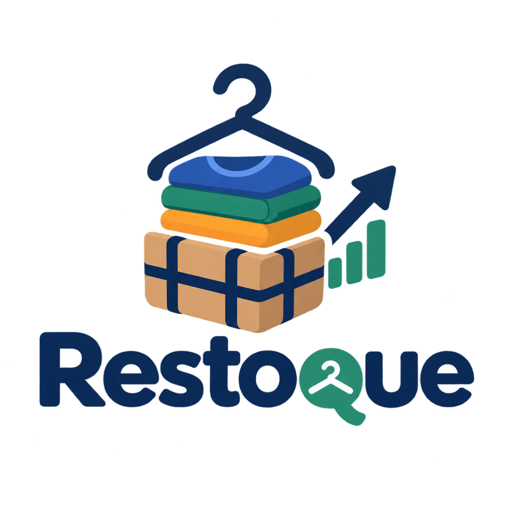

<div align="center">



# Restoque

**Inventario y punto de venta para ropa usada, desde la paca hasta la prenda.**

[](https://www.python.org/)
[](https://fastapi.tiangolo.com/)
[](https://react.dev/)
[](https://www.typescriptlang.org/)
[](#pwa)

</div>

---

## El problema

Cuando se compra ropa por pacas, la inversión se registra como un solo lote, pero la venta ocurre prenda por prenda. Restoque conecta ambas partes: conserva la paca como origen financiero y convierte su contenido en un catálogo sencillo de prendas, cantidades y precios.

## La solución

Restoque permite clasificar, vender y medir el rendimiento de cada paca desde una interfaz táctil pensada para el uso diario en una tienda pequeña. La persona que vende trabaja con prendas; el sistema se encarga de existencias, ingresos, recuperación de inversión y reportes.

## Modelo de inventario

Una línea representa prendas equivalentes:

```text
Paca: Ropa americana septiembre
    Camisa buena calidad  · C$ 200 · 10 disponibles
    Camisa regular        · C$ 120 · 8 disponibles
    Pantalón buena calidad · C$ 250 · 5 disponibles
```

La paca permanece como origen interno. En el punto de venta se muestra principalmente el tipo de prenda, su precio y el stock disponible.

## Funcionalidades

- Registro de pacas, costo y peso.
- Clasificación de prendas por tipo, cantidad y precio de venta.
- Punto de venta táctil para registrar ventas rápidamente.
- Control atómico de existencias para evitar sobreventas.
- Carrito con cantidades, total y cálculo de vuelto.
- Dashboard de ventas, inversión, recuperación y ganancias.
- Historial de ventas y exportación a Excel.
- Autenticación mediante API key y sesión administrativa con token firmado.
- Validación de claves foráneas en SQLite.
- Interfaz instalable en Android o iOS como PWA.

## Arquitectura

```text
frontend/ React + TypeScript + Vite
    |
    | HTTP /api
    v
app/ FastAPI + SQLAlchemy async
    |
    v
SQLite para una instalación individual
PostgreSQL recomendado para varias terminales
```

El backend sirve el frontend compilado desde `frontend/dist` cuando esa carpeta existe. En desarrollo, Vite reenvía las llamadas `/api` al backend local.

## Requisitos

- Python 3.11 o superior.
- Node.js 20 o superior.
- npm.
- SQLite para desarrollo o una base PostgreSQL para producción multiusuario.

## Instalación local

### Backend

Desde la raíz del repositorio:

```powershell
py -3 -m venv .venv
.\.venv\Scripts\Activate.ps1
py -3 -m pip install -r requirements.txt
py -3 -m pip install -r requirements-dev.txt
```

Crea un archivo `.env` en la raíz. No lo subas al repositorio:

```env
DATABASE_URL=sqlite+aiosqlite:///./restoque.db
DEBUG=true
ADMIN_PIN=cambia-este-pin
SECRET_KEY=crea-una-clave-de-al-menos-32-caracteres
RESTIQUE_API_KEY=crea-otra-clave-larga
```

`ADMIN_PIN` y `SECRET_KEY` son obligatorios. La aplicación no debe iniciar si faltan o son demasiado cortos.

Inicia la API:

```powershell
py -3 -m uvicorn app.main:app --reload --host 127.0.0.1 --port 8000
```

### Frontend

En otra terminal:

```powershell
Set-Location frontend
npm install
npm run dev
```

Abre `http://localhost:5173`.

Para generar la versión que sirve FastAPI:

```powershell
npm run build
```

## Pruebas

Backend:

```powershell
py -3 -m pytest -q
```

Frontend:

```powershell
Set-Location frontend
npm test -- --run
npm run build
```

La suite cubre autenticación, API key, claves foráneas, rollback de ventas, prevención de sobreventa, concurrencia, reportes, exportación Excel y lógica del carrito.

## Base de datos y migraciones

La base actual usa `Numeric(12, 2)` para importes monetarios y claves foráneas activas en SQLite.

`migrate_money.py` es una migración de una sola ejecución para bases SQLite antiguas que todavía almacenan dinero como `FLOAT`:

```powershell
py -3 migrate_money.py
```

La migración crea una copia `restoque.db.bak-*` antes de reemplazar las tablas. Verifica el backup y valida los datos antes de eliminarlo.

Para una instalación nueva, `Base.metadata.create_all()` crea las tablas al iniciar. Para cambios futuros de esquema se recomienda incorporar Alembic antes de desplegar una versión nueva sobre datos reales.

## Despliegue

### Instalación individual

Para una sola computadora y un solo punto de venta, SQLite puede ser suficiente. La computadora debe permanecer encendida y accesible para los dispositivos autorizados.

### Servidor en internet

Para que la PWA funcione sin depender de una computadora personal:

1. Compila el frontend con `npm run build`.
2. Ejecuta FastAPI como servicio permanente.
3. Configura las variables de entorno en el proveedor, nunca dentro del repositorio.
4. Usa HTTPS y un dominio.
5. Usa PostgreSQL si habrá varias terminales o usuarios simultáneos.
6. Configura backups automáticos y prueba la restauración.

El servicio debe arrancar con el puerto proporcionado por el proveedor, por ejemplo:

```bash
uvicorn app.main:app --host 0.0.0.0 --port ${PORT:-8000}
```

Los servicios gratuitos con sistema de archivos efímero no deben usarse con `restoque.db` como almacenamiento principal. Si se utiliza un proveedor con suspensión por inactividad, la primera carga puede tardar; la base de datos debe permanecer en almacenamiento persistente.

### Oracle Cloud Always Free

Para una instalación sin pago mensual, Oracle Cloud Always Free puede alojar la aplicación en una VM Linux. La disponibilidad de una VM gratuita depende de la capacidad de la región y Oracle puede pedir verificación de identidad o tarjeta.

La configuración preparada en `deploy/oracle/` usa:

- SQLite en `/var/lib/restoque/restoque.db`.
- `systemd` para iniciar y reiniciar FastAPI.
- Caddy como proxy HTTPS.
- Un backup SQLite diario conservado durante 14 días.

#### Instalación resumida

En la VM Ubuntu, instala Python, Node.js, SQLite, Git y Caddy. Después clona el repositorio:

```bash
sudo mkdir -p /opt/restoque /var/lib/restoque /etc/restoque
sudo useradd --system --home /opt/restoque --shell /usr/sbin/nologin restoque || true
sudo chown -R restoque:restoque /opt/restoque /var/lib/restoque
git clone https://github.com/freddyguevara085-stack/Restoque.git /opt/restoque
cd /opt/restoque
python3 -m venv .venv
.venv/bin/pip install -r requirements.txt
cd frontend && npm install && npm run build
```

Copia la configuración y edita los secretos:

```bash
sudo cp deploy/oracle/restoque.env.example /etc/restoque/restoque.env
sudo nano /etc/restoque/restoque.env
sudo chmod 600 /etc/restoque/restoque.env
```

Instala el servicio y los backups:

```bash
sudo cp deploy/oracle/restoque.service /etc/systemd/system/
sudo cp deploy/oracle/backup-restoque.sh /usr/local/sbin/
sudo cp deploy/oracle/restoque-backup.service /etc/systemd/system/
sudo cp deploy/oracle/restoque-backup.timer /etc/systemd/system/
sudo chmod 750 /usr/local/sbin/backup-restoque.sh
sudo systemctl daemon-reload
sudo systemctl enable --now restoque.service restoque-backup.timer
```

Para HTTPS, usa un dominio gratuito como DuckDNS apuntando a la IP pública de la VM. Copia `deploy/oracle/Caddyfile.example` a `/etc/caddy/Caddyfile`, reemplaza el dominio y ejecuta:

```bash
sudo systemctl reload caddy
```

Abre los puertos TCP `80` y `443` en las reglas de red de Oracle y en el firewall de Ubuntu. No expongas el puerto `8000` públicamente.

Comprueba el servicio y el backup:

```bash
systemctl status restoque.service
systemctl list-timers restoque-backup.timer
curl -I https://tu-dominio.example
```

Esta opción evita el sueño de Render y no requiere pagar un VPS, pero requiere administrar la VM y conservar copias del backup fuera de Oracle.

## PWA

Después de desplegar con HTTPS:

- Android: abre la URL en Chrome y elige `Agregar a pantalla de inicio`.
- iPhone: abre la URL en Safari, pulsa `Compartir` y elige `Agregar a inicio`.

La PWA es la interfaz móvil; los datos siguen guardados en el backend y en la base de datos del servidor.

## Backups

El backup debe incluir la base de datos y conservar varias copias históricas. En producción:

- No dependas únicamente del disco del servidor.
- Guarda al menos una copia fuera del proveedor.
- Verifica periódicamente que una copia pueda restaurarse.
- No publiques `.env`, claves, tokens ni archivos `.db`.

## Seguridad

- Mantén `DEBUG=false` en producción.
- Usa una API key larga y aleatoria.
- Cambia el PIN de ejemplo antes de entregar la aplicación.
- Usa una `SECRET_KEY` aleatoria de al menos 32 caracteres.
- No expongas directamente el puerto interno de Uvicorn si puedes colocar un proxy HTTPS delante.
- Revisa los logs y los límites de acceso del proveedor.

## Estructura principal

```text
app/                 Backend FastAPI
app/routers/         Endpoints de autenticación, inventario, ventas y reportes
frontend/src/        Aplicación React y PWA
frontend/public/     Manifest y recursos públicos
tests/               Pruebas del backend
deploy/oracle/       Servicio systemd, Caddy y backups para Oracle Cloud
migrate_money.py     Migración de importes FLOAT a NUMERIC
requirements.txt     Dependencias de producción
requirements-dev.txt Dependencias de pruebas
```

## Licencia

Uso privado del proyecto Restoque.
